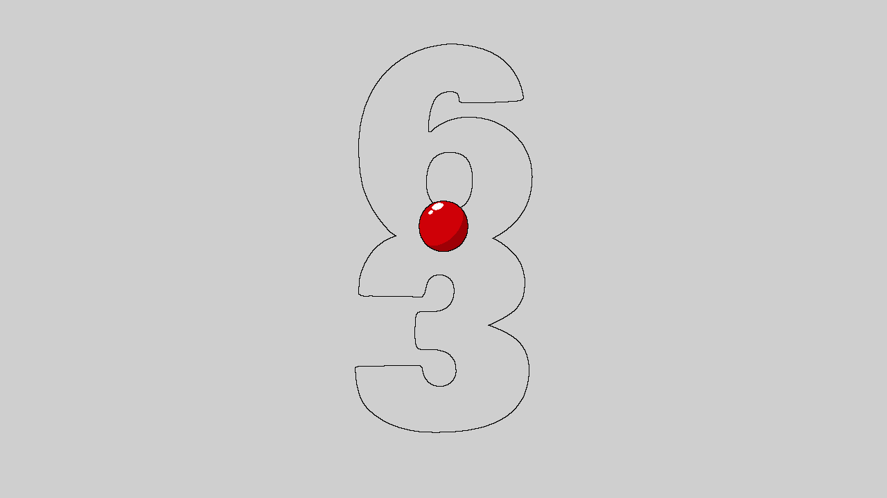
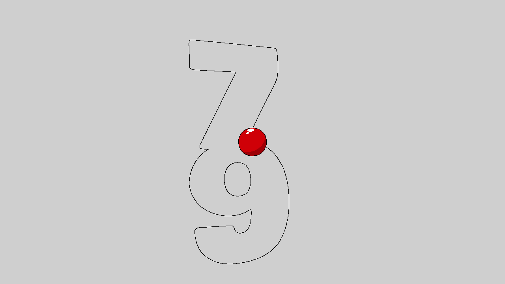
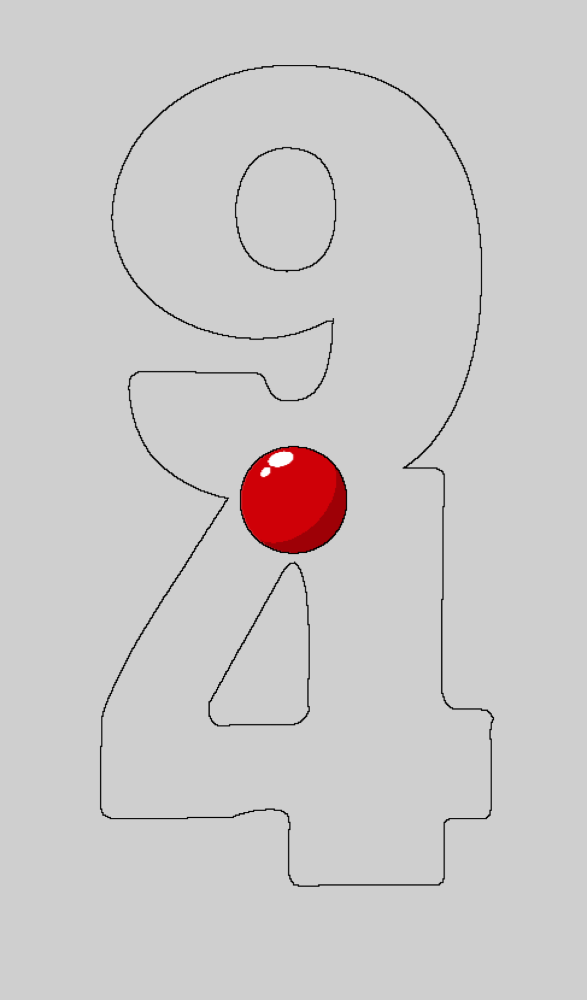
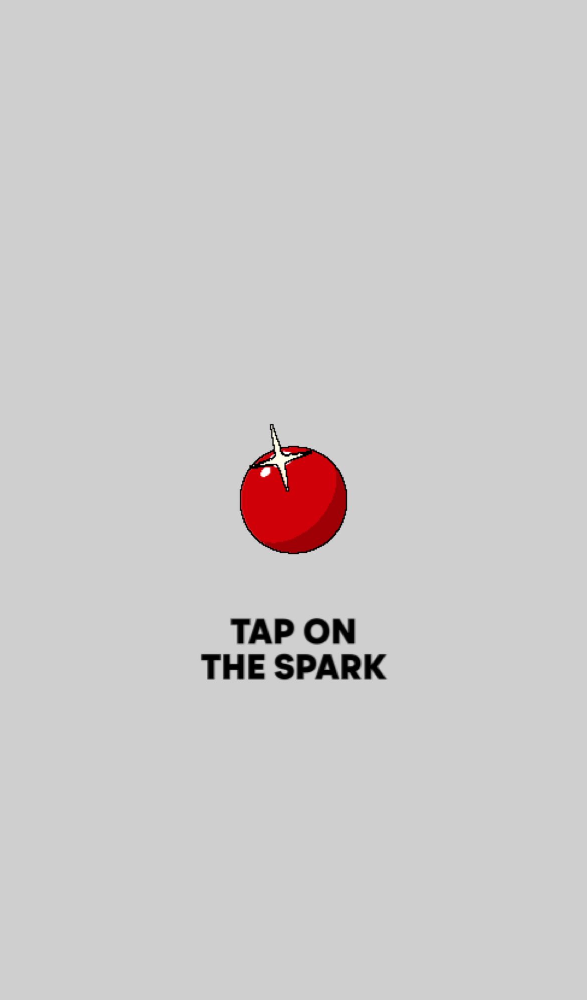

# Monolith Financial Rebrand Walkthrough

### Financial Rebrand & Narrative Transformation

I have successfully transformed the project into a high-utility financial services experience while fixing a critical engine crash.

#### Phase 1: Engine Repair

- **Bug Fix**: Resolved a `JSONDecodeError` and a subsequent `SyntaxError` in the minified `index.js` caused by improper text replacements.
- **Stabilization**: Restored the spatial timeline by fixing the `choreography.json` segment array syntax.

#### Phase 2: String-Safe Rebranding

Applied a guarded text replacement strategy to update the narrative without breaking JavaScript identifiers:

- **Capital Foundations** (Foundational Consultancy)
- **The Liquidity Bridge** (Salary Advance)
- **Alpha Horizons** (Investment Research)
- **The Wealth Legacy** (Financial Future)

#### Phase 3: Comprehensive Visual Audit (Playwright)

I've executed a full representative audit across Desktop and Mobile viewports using Playwright to confirm global health.

````carousel

<!-- slide -->

<!-- slide -->

<!-- slide -->

````

- **Desktop (1280x720)**: Scene initialization, narrative overlays, and credits verified.
- **Mobile (iPhone 13)**: Resolution fallback strategy confirmed functional via symlinked assets (`textures-25`, etc.). The 3D scene and branding are fully responsive.
- **Production Root**: Successfully replaced existing site at `https://the-monolith-project.pages.dev/`. Smoke test passed.
- **Identity Update**: Renamed site title and metadata from "The Monolith Project" to **"Moe"**.
- **Domain Cleanup**: Removed all legacy references to `themonolithproject.net` to ensure perfect SEO and metadata consistency.

### Final Status: 💎 FULLY RESTORED & OPTIMIZED

#### Code Verification (Live Bundle)

I verified the deployed bundle directly:

```javascript
// Snapshot from https://master.the-monolith-project.pages.dev/assets/index-Dqw2FXdk.js
const items=[{roles:["Creator"],name:"MoeCapital"}]
```


### Credits Update

## 📁 Project Structure

The project has been organized to mirror the production setup:

- [public/](/Users/brixelectronics/Documents/mac/monolith/public): Contains the production build retrieved from the Cloudflare Pages deployment.
  - `index.html`: Main entry point.
  - `assets/`: Core CSS and JS bundles.
- [public/assets-r2/](/Users/brixelectronics/Documents/mac/monolith/public/assets-r2): Contains media, 3D models, and fonts synced from the `the-monolith-assets` R2 bucket.
- [wrangler.toml](/Users/brixelectronics/Documents/mac/monolith/wrangler.toml): Configuration for local development, including R2 bindings and environment variables.

## 🚀 Key Accomplishments

1. **Frontend Discovery**: Identified the active Pages deployment (`the-monolith-project.pages.dev`) and extracted the latest production build.
2. **Asset Synchronization**: Implemented a custom synchronization protocol using `wrangler r2 object get --remote` to maintain folder integrity for all 3D models and media.
3. **Infrastructure Mapping**: Verified active KV namespaces and D1 databases associated with your account.
4. **Manifest Stabilization**: Discovered and repaired a critical P0 syntax error in `choreography.json` that broke scroll-based scene transitions.
5. **Quality Guardrails**: Implemented a `scripts/validate_manifest.js` tool to perform structural audits on the choreography engine.
6. **GitHub Publication**: Published the stabilized project to [criticalinsight/the-monolith-project](https://github.com/criticalinsight/the-monolith-project).

## 📁 Repository Links

- **GitHub**: [the-monolith-project](https://github.com/criticalinsight/the-monolith-project)
- **Local Path**: [monolith/](/Users/brixelectronics/Documents/mac/monolith)

## 🛠️ Next Steps

### Development

To run the project locally and verify the assets:

```bash
npx wrangler pages dev ./public --r2=R2_ASSETS=the-monolith-assets
```

### Validation

Whenever you modify the choreography manifest, run:

```bash
node scripts/validate_manifest.js
```
